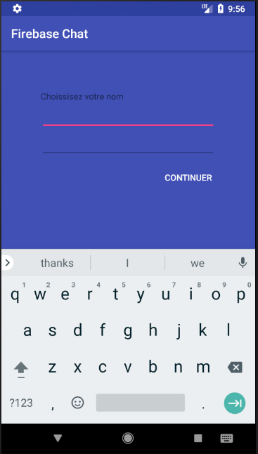
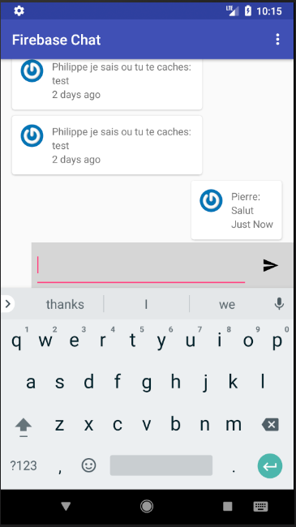
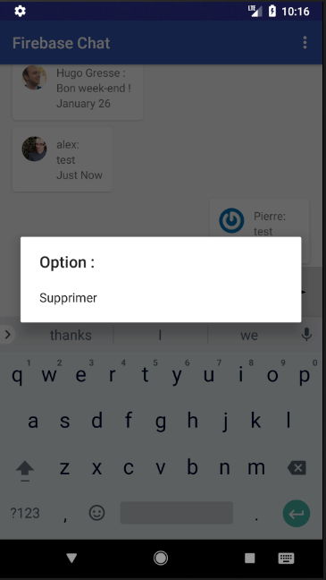

# ProjetAndroid

> Application de messagerie instantanée 

## Fonctionnalités

- Connexion de l'utilisateur
- Envoi de message
- Suppression de messages
- Deconnexion

## Captures d'écran :

## Auteur

**Combes Pierre**

## [LICENSE](https://github.com/zLopOx/ProjetAndroid/blob/master/LICENSE)
